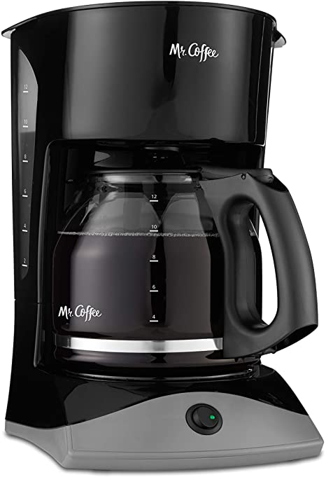

Brewing a cup of coffee with the Mr. Coffee 12-Cup Coffee Maker

---

Functionality:
User needs one or more cups of coffee. User decides how much coffee to make, confirms the coffeemaker is plugged in, puts in a coffee filter and correct amounts of water and coffee grounds. User toggles power switch. Coffeemaker brews coffee. User waits for "beep" to signify coffee is done. User pours a cup of coffee.

* IF coffeemaker is unplugged, User plugs into outlet and continues to next step ELSE IF coffeemaker already plugged in, User continues to next step
* How many cups of coffee are desired?
* User calculates water and coffee grounds needed for cups of coffee desired
* IF water is available, User adds water to coffeemaker ELSE User goes to Starbucks
* IF coffee filter is available, User adds coffee filter to coffeemaker ELSE User goes to Starbucks
* IF enough coffee grounds are available, User adds coffee grounds to coffeemaker, ELSE User goes to Starbucks
* IF coffee pot is not on warming plate, User places coffee pot on warming plate, ELSE skips to next step
* IF switch is off, User changes it to "on" ELSE User continues
* Coffeemaker brews coffee
* WHILE coffeemaker is brewing, User waits
* Water drips over coffee grounds and becomes coffee
* Coffeemaker beeps
* User pours a cup of coffee
* User drinks coffee

---

Numbers, Booleans, Strings, Arrays, Functions

* coffeeMaker - array of objects
    * powerSwitch
        * needs boolean
    * waterTank
        * waterWindow
            * Displays available water in tank
    * warmingPlate
        * warm
            * holds coffeePot
    * powerCable
        * connects to outlet, powers coffeeMaker
    * filterBasket
        * holds coffeeFilter, coffeeGrounds

---

    START // begin program

    INIT()

    User.determinePluggedIn(coffeePot);
    User.determineCupsWanted();
    User.checkWaterLevel(waterWindow);
        IF (lid = closed) {
            User.openLid();
        }

        IF (water = true) {
        WHILE (currentWater < cupsWanted) {
            User.fillWaterTank();
        }; } ELSE {
            goToStarbucks();
            return("Well, never mind, there's no water. To Starbucks!");
            }

        IF (coffeeFilter >= 1) {
            User.placeFilter(filterBasket)
        } ELSE {
            goToStarbucks();
            return("Well, never mind, we're out of filters. To Starbucks!");
            };

        IF (coffeeGrounds >= coffeeGroundsNeeded) {
            measureCoffeeGrounds(measuringSpoon, coffeeGrounds);
            placeCoffeeGrounds(coffeeFilter);
        } ELSE IF (coffeeGrounds < coffeeGroundsNeeded) {
            goToStarbucks();
            return("Well, never mind, we're out of coffee grounds. To Starbucks!");
        }

    IF (coffeeFilter.contains(coffeeNeeded) AND (waterInTank >= waterNeeded)) {
        User.toggleLid();
        User.placeCoffeePot(warmingPlate);
        IF (powerSwitch === off) {
            User.toggleSwitch(switch);}
            coffeeMaker.brew();
        IF (beep = false) {
        waitForBeep();
    } ELSE IF (beep) {
        User.pourCoffee(coffeePot, catMug);
    };
    
    User.drinkCoffee();

    //end program

// Define Objects and Functions

Object

    Function

User:

    determinePluggedIn
    determineCupsWanted
    toggleLid
    checkWaterLevel
    fillWaterTank
    placeFilter
    placeCoffeeGrounds
    toggleSwitch
    waitForBeep
    pourCoffee
    goToStarbucks

CoffeePot:

    brew
    beep

filterBasket
    holdCoffeeFilter
    holdCoffeeGrounds

waterTank
    holdWater

catMug

    containCoffee

INIT functions

        CREATE switch
        CREATE coffeeMaker
        CREATE coffeePot
        CREATE coffeeGrounds
        CREATE measuringSpoon
        CREATE User
        CREATE warmingPlate
        CREATE waterTank
        CREATE water
        CREATE coffeeFilter
        CREATE catMug
